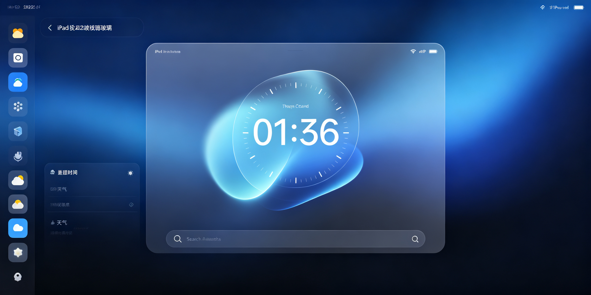
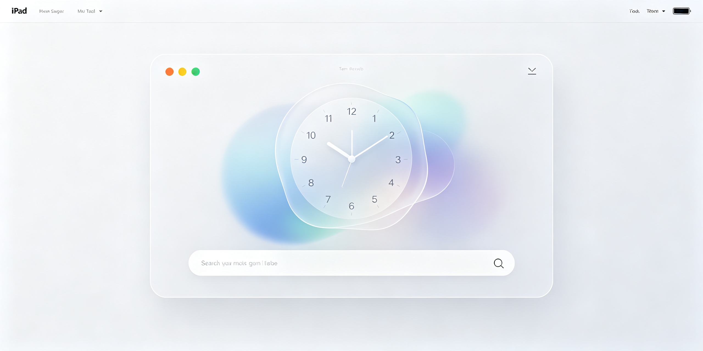
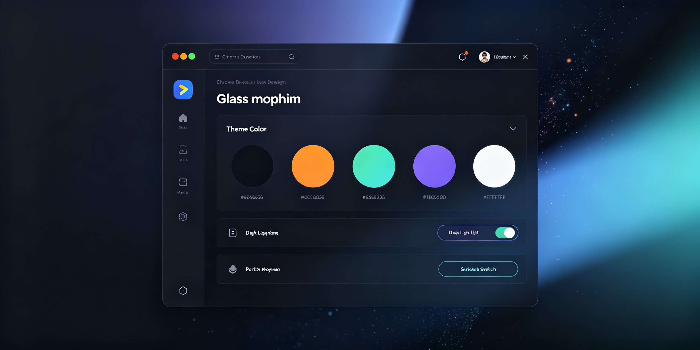

<div align="center">

# 🌅 OpenTab

**一个精致的 Chrome 新标签页扩展，iPad 风格毛玻璃设计，让你的新标签页既好看又好用。**

[](LICENSE)
[](manifest.json)
[](manifest.json)

</div>

---

## ✨ 功能特性

### 🕐 时钟与日历
- **iPad 风格时钟**：优雅的毛玻璃卡片设计，支持 12h/24h 切换
- **多时区支持**：内置 23 个常用时区，一键切换
- **秒数显示**：可开关的秒数显示
- **日历组件**：带节假日和节气标记的日历

### 🎨 个性化主题
- **深色/浅色主题**：支持深色、浅色、自动跟随系统三种模式
- **主题色自定义**：6 种精选主题色（极光蓝、梦幻紫、日落橙、薄荷绿、樱花粉、星空蓝）
- **动态粒子背景**：科技感粒子效果，颜色跟随主题色
- **渐变流动动画**：背景渐变缓慢流动
- **极简模式**：双击时钟进入沉浸模式，只显示时间

### 🖼️ 背景系统
- **Bing 每日壁纸**：每天自动更新必应美图
- **预设渐变**：精选多款渐变背景
- **自定义背景**：支持自定义图片/视频 URL

### 🔗 快捷方式
- **快捷链接**：一键添加常用网站
- **SSH 终端**：内置终端，通过 WebSocket 网关连接 SSH
- **开发者工具**：JSON 格式化、FIX 协议解析器
- **文件夹分类**：工作区抽屉，支持拖拽排序

### 🔍 搜索栏
- **多引擎切换**：Google、Bing、GitHub 一键切换
- **毛玻璃设计**：与整体风格统一

### ☁️ 天气小组件
- **自动定位**：基于地理位置获取天气
- **wttr.in 数据源**：简洁美观的天气展示

### ✅ 待办事项
- **侧边抽屉式**：不占主界面空间
- **进度条显示**：直观展示完成进度
- **本地存储**：数据持久化保存

### 💾 备份与恢复
- **JSON 导出/导入**：轻松备份和迁移配置
- **快照功能**：快速保存和恢复配置状态

---

## 📸 预览

### 深色主题


### 浅色主题


### 设置面板


---

## 🚀 快速开始

### 安装方式

#### 方式一：开发者模式加载（推荐自己用）

1. 下载或克隆本项目
2. 打开 Chrome，访问 `chrome://extensions/`
3. 开启右上角的「开发者模式」
4. 点击「加载已解压的扩展程序」
5. 选择项目根目录
6. 打开新标签页，享受 OpenTab！

#### 方式二：Chrome 网上应用店（待发布）

> 即将上架 Chrome Web Store，敬请期待

---

## 📖 使用说明

### 基础操作
- **打开设置**：点击右下角齿轮图标
- **切换主题**：设置 → 主题 → 选择深色/浅色/自动
- **更换主题色**：设置 → 主题 → 点击颜色预设
- **极简模式**：双击时钟卡片进入/退出
- **添加快捷方式**：点击左侧 + 号按钮
- **打开待办**：点击左侧清单图标

### 背景设置
- **Bing 每日壁纸**：每天自动更新，点击刷新按钮可切换历史壁纸
- **渐变背景**：多款精选渐变可选
- **自定义背景**：填入图片或视频 URL 即可

### SSH 终端
SSH 功能需要本地运行 WebSocket 网关：

```bash
# 安装依赖
npm install

# 启动 SSH 网关
npm run ssh:gateway
```

默认网关地址：`ws://127.0.0.1:8787/ssh`

**环境变量配置：**
- `SSH_GATEWAY_HOST` - 网关主机（默认 `127.0.0.1`）
- `SSH_GATEWAY_PORT` - 网关端口（默认 `8787`）
- `SSH_PRIVATE_KEY_PATH` - 私钥路径（默认 `~/.ssh/id_rsa`）
- `SSH_PRIVATE_KEY_PASSPHRASE` - 私钥口令（如有）

支持 SOCKS5 代理连接。

---

## 🛠️ 开发指南

### 项目结构

```
open-tab/
├── manifest.json          # MV3 扩展配置
├── background.js          # Service Worker
├── home.html              # 新标签页主页面
├── home.css               # 主页面样式
├── home.js                # 主页面逻辑
├── popup.html             # 工具栏弹窗
├── popup.css              # 弹窗样式
├── popup.js               # 弹窗逻辑
├── tool.html              # 开发者工具页面
├── tool.css               # 工具页面样式
├── tool.js                # 工具页面逻辑
├── ssh_terminal.html      # SSH 终端页面
├── ssh_terminal.css       # 终端样式
├── ssh_terminal.js        # 终端逻辑
├── ssh-gateway.mjs        # SSH WebSocket 网关
├── icons/                 # 扩展图标
│   ├── icon16.png
│   ├── icon48.png
│   └── icon128.png
├── assets/                # 静态资源
├── tests/                 # E2E 测试
├── docs/                  # 文档
└── .github/workflows/     # CI 配置
```

### 本地开发

```bash
# 安装依赖
npm install

# 安装 Playwright 浏览器（用于测试）
npm run pw:install
```

在 Chrome 中加载扩展后，修改代码后点击扩展卡片上的刷新按钮即可生效。

### 自动化测试

```bash
# 运行所有测试
npm test

# 有头模式（推荐，扩展加载更稳定）
npm run test:e2e

# 无头模式
npm run test:e2e:headless

# CI 模式
npm run test:ci
```

详细测试说明见 [docs/TESTING.md](docs/TESTING.md)

### CI/CD

项目已配置 GitHub Actions 自动测试：
- 触发条件：`push` / `pull_request`
- 运行环境：Ubuntu + Node 20
- 测试流程：安装依赖 → 安装 Playwright → 执行 E2E 测试

---

## 📝 技术栈

- **原生 HTML/CSS/JavaScript** - 无框架依赖，轻量高效
- **Manifest V3** - 最新 Chrome 扩展标准
- **flatpickr** - 日历组件
- **xterm.js** - 终端组件
- **ssh2 + ws + socks** - SSH 网关
- **Playwright** - E2E 自动化测试

---

## 🤝 贡献

欢迎提交 Issue 和 Pull Request！

1. Fork 本项目
2. 创建你的特性分支 (`git checkout -b feature/AmazingFeature`)
3. 提交你的改动 (`git commit -m 'Add some AmazingFeature'`)
4. 推送到分支 (`git push origin feature/AmazingFeature`)
5. 开启一个 Pull Request

---

## 📄 许可证

本项目采用 MIT 许可证 - 详见 [LICENSE](LICENSE) 文件

---

<div align="center">

**如果觉得好用，别忘了给个 ⭐ Star 支持一下！**

Made with ❤️ by OpenTab Team

</div>
